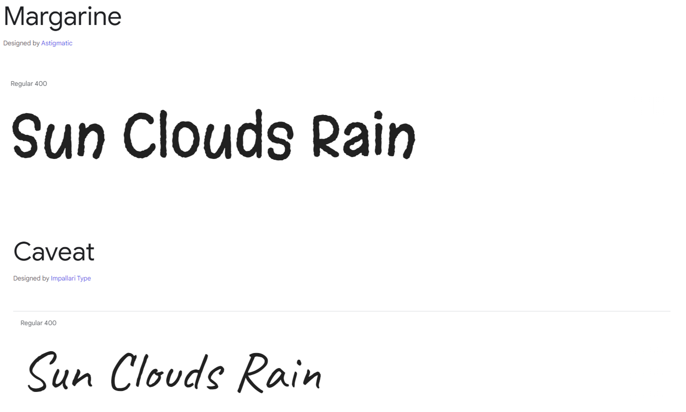
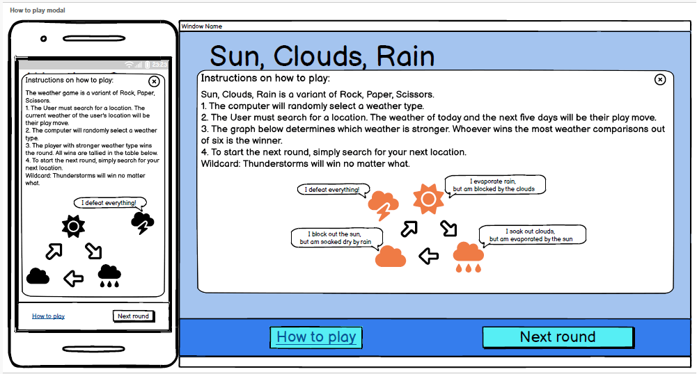

# Sun Clouds Rain

Sun Clouds Rain is a site that is targetted towards chiildren to look up the weather for a given location - with the current day and a further 5 days weather forecast shown for the location entered.  The experience also includes a game - Sun Clouds Rain, which is similar to Rock Paper Scissors but using the Weather.  The computer randomly picks some Weather, which is then compared against each of the six days of weather shown for the user. A winner is identified and displayed.

## Index – Table of Contents
* [User Experience (UX)](#user-experience-ux) 
* [Features](#features)
* [Design](#design)
* [Project Management](#project-management)
* [Technologies Used](#technologies-used)
* [Testing](#testing)
* [Deployment](#deployment)
* [Credits](#credits)

## User Experience (UX)

An ideation process was undertaken to suggest and prioritise the user experience for the site.  From this user stories were generated, prioritised (including establishing a Minimum Viable Product) and managed using a Kanban board on GitHub.

-   ### User stories

    -   #### Weather MVP (Minimum Viable Product):
        1. In order to **see what website I am on** as a **user**, I can **see the h1 title at the top of the page**
        2. In order to **select a location for the weather** as a **user**, I can **type in a location in the search bar**
        3. In order to **submit my weather request** as a **user**, I can **click the search button**
        4. In order to **see today’s weather** as a **user**, I can **see on the left side a big section with today’s temperature and weather symbol**
        5. In order to **know that it is a weather forecast** as a **user**, I can **see a h2 that explains that this is a weather forecast**
        6. In order to **see the forecast for the next five days** as a **user**, I can **see the next five days forecast just right of today’s forecast with day of the week listed above each symbol**
        7. In order to **clearly understand what the website is about** as a **user**, I can **see a big orange container with a welcome message, brief explanation of what the website is for and what step one is**

        #### Weather Enhancements:
        8. In order to **avoid getting information from a place in the wrong country** as a **user**, I can **select my country from the drop down**
        9. In order to **see which location and country I have selected** as a **user**, I can **see my choice  next to the words: ‘user choice’**
        10. In order to **understand where the weather location is** as a **user** I can **see a map with the selected location marked on it.**
        11. In order to **get a full weather view** as a **user**, I can **see pressure, humidity, pollen count and wind speed as part of the forecast**
        12. In order to **clearly see the 5 day forecast** as a **user**, I can **see the date for each days forecast**
        13. In order to **promote the site as a way to engage users** as a **provider**, I can **give about us info on our organization and its aims**
        
        #### Sun Clouds Rain Game MVP:
        14. In order to **know that my weather is competing against the computer** as a **user**, I can **see a big vs sign just right of my selection**
        15. In order to **see what the computer has chosen** as a **user**, I can **see the computer’s weather icon below the words ‘The weather to beat’**
        16. In order to **know which weather has beaten or been beaten by the computer’s choice** as a **user**, I can **see a + or - symbol below each days weather symbol**
        17. In order to **to see a sum of how many wins I got** as a **user**, I can **see the tally next the text /6 at the bottom of the page**
        18. In order to **clearly see who won the round** as a **user**, I can **see text at the bottom of the page which says ‘computer wins’ or ‘You won’**
        19. In order to **to see information on how to play** as a **user**, I can **click the ‘how to play’ button found in the footer and see a diagram and steps appear in a pop up container**
        20. In order to **compete against a new computer choice** as a **user**, I can **press the ‘next round’ button**
        21. In order to **focus on the weather** as a **user**, I can **see the weather and choose whether or not to start the game.**
          
          #### Sun Clouds Rain Game Enhancements
        22. In order to **get to know other Sun, Clouds, Rain competitors** as a **user**, I can **join a social media community of other users**
        23. In order to **personalize the app** as a **user**, I can **enter my name and have it shown in the game versus the computer.**
        24. In order to **promote continued playing of the game** as a **user**, I can **see cumulative scores for multiple rounds of the game**
  
## Features 

### Features Completed

- __Landing Page__
  - The site consists of a single landing page which clearly identifies the purpose of the site, is responsive and allows the user to enter their location and get a Weather Forecast.  On first entering the site a large banner is shown in the midle of the screen to explain it.  This banner is removed once the user enters a location and requests a weather forecast.  It is then replaced with the Sun Clouds Rain scoring statement.

- __Capture Search Location for Weather__

  - The site has a clearly marked input field for the user to enter the location that they want for the weather forecast.  A country pull down is also included, to help resolve any issues arising from identical location names in different countries.  At this stage only a limited number of countries have been added and future work is needed to increase the country coverage. It defaults to the UK.

- __Capture First name for Sun Clouds Rain Game__

  - The site has a clearly marked input field for the user to enter their first name.  Which is then used as part of the Sun Clouds Rain game to tailor the score messaging.

- __Submit Search Location for Weather Forecast__

  - The site has a clearly marked search (submit) button - to submit the location and get a Weather Forecast.  This button also submits the first name for the first round of the Sun Clouds Rain game.
  - When this button is clicked - the orange information banner is also removed from the screen and replaced with the scoring statement for the Sun Clouds Rain Game.

- __Confirmation of Location__

  - Todays weather togther with confirmation of the Location is displayed after search (submit) is clicked.

- __Today and 5 Days of Weather__

  - Todays weather (Temperature in degrees celcius and the Cloud/Rain/Sun symbol) is shown at the left hand side.
  - The weather for the next five days is shown to the right of todays weather.

- __Sun Clouds Rain Game - Computer Choice__ 

  - The computer randomnly selects some weather to play against the user in the Sun Clouds Rain Game.  This is displayed to the right, after the VS (versus) symbol.

- __Sun Clouds Rain Game Score__ 

  - The result of the Sun Cluds Rain game is shown under each days weather.
  - Green tick - user won.
  - Red Cross - computer won.
  - Blue Equals - draw.
  - These results are correlaterd into an overal winners statement at the bottom tailored with the name the user entered.

- __Sun Clouds Rain Rules__

  - A How to play set of rules is provided and when clicked the rules pop up in a modal. They can be cancelled and the user returns to the main screen.

- __New game__

  - The new game button, resets the Sun Clouds Rain Game.  The computer randomnly selects some new weather for the Sun Clouds Rain game.  The user can enter a new weather forecast location  - to get new weather and play the game again.

### Features Left to Implement

- Countries: an initial 5 countris have been added for the country validation activity.
	- This list to be extnded to cover a wider range of countries.
  - Investigate better use of the existing API to facilitate this.

- Display of Weather Location on a Map
	- It would be good to show a Google Map (or similar) of the location entered for the weather to help validate the weather is for the location expected.
  - Investigate how the goggle maps API could be used to provide this.

- Show day and dates against forecast
	- It would help the users understanding of the weather to see the day name and date against each days forecast.
  
- Multiple round scoring
  - To encourage repeated use of the site, add an ongoing score capability that extemds the scoring across multiple rounds.

## Design

-   ### Single Page
    -  We agreed that the site should be based on using a single page. Using JavaScript to dynamically change the display based on user entry.  A bootstrap modal was selected to display the game rules.

-   ### Colour Scheme
    -  We agreed that blue colours (clouds) mixed with bright (weather) colours would work for our website. Including blue was important to underpin the link to weather. The colours picked were generated using the website [Coolors](https://coolors.co/)

        

-   ### Typography
    - Google Fonts were used to import Caveat and Maragrine fonts into styles.css.  These were chosen as they looked informal and related to the use of the site by children.
 
       

-   ### Logo/Icon
    - The logo design incorporates a smiling sun character image. This to reflect weather, the focus on younger users and creating fun from the game. The logo was generated using [bing copilot designer](https://www.bing.com/chat?q=Microsoft+Copilot&FORM=hpcodx)
 
	

-   ### Wireframes

    -   #### Site Landing Wireframe

        

    -   #### Weather and Game Wireframe

        

    -   #### Game Rules Wireframe

        

## Project Management

- An ideation process was undertaken to suggest and prioritise the user experience for the site.  From this user stories were generated, prioritised (including establishing a    Minimum Viable Product) and managed using a Kanban board on GitHub.

- Each user story:
  - Included Acceptance Criteria and Tasks.
  - Was tagged with its MoSCoW priority rating.
  - Was assigned an owner.
  - Was managed by the owner across to Done

- The Kanban board was regulalry reviewed bu the team.

  -   #### Kanban Board

      [Link to Kanban Board](https://github.com/users/suba-suresh/projects/2)

- The Weather MVP and Sun Cloud Rain Game MVP user stories were completed.  In additiona - some of the Weather and some of the Sun Cloud Rain Game enhancement user stories were completed.

## Technologies Used

### Languages Used

-   [HTML5](https://en.wikipedia.org/wiki/HTML5)
-   [CSS3](https://en.wikipedia.org/wiki/Cascading_Style_Sheets)
-   [JavaScript](https://en.wikipedia.org/wiki/JavaScript)

### Frameworks, Libraries & Programs Used

-   [Google Fonts:](https://fonts.google.com/) was used to import the 'Margarine' and 'Caveat' fonts into the style.css file which are used across the project site page.
-   [Font Awesome:](https://fontawesome.com/) was used to add icons for aesthetic and UX purposes.
-   [Git:](https://git-scm.com/) was used for version control by utilising the Gitpod terminal to commit to Git and Push to GitHub.
-   [GitHub:](https://github.com/) is used as the respository for the projects code after being pushed from Git.
-   [Balsamiq:](https://balsamiq.com/) was used to create the wireframes during the design process.
-   [bootstrap 5.3:](https://getbootstrap.com/) was the framework used to create a responsive page and the rules modal.
-   [favicon:](https://favicon.io/) was used for creating website page tab icon.
    

## Testing 

### Validator Testing 

- HTML
  - 4 errors were returned when passing through the official [W3C validator](https://validator.w3.org/nu/?doc=https%3A%2F%2Fmarkchips.github.io%2Fprevent-awareness%2Findex.html)
- CSS
  - 1 error was found when passing through the official [(Jigsaw) validator](https://jigsaw.w3.org/css-validator/validator?uri=https%3A%2F%2Fmarkchips.github.io%2Fprevent-awareness%2Findex.html&profile=css3svg&usermedium=all&warning=1&vextwarning=&lang=en)
- JavaScript

### Unfixed Bugs

- Page content keeps disappearing behind header on some screen sizes. This relates to the header being position: fixed. The content needs the margin to be adjusted.

## Deployment

- The site was deployed to GitHub pages. The steps to deploy are as follows: 
  - In the GitHub repository, navigate to the Settings tab
  - Click pages on the left side
  - In the branch section, use the drop down menu to select the main branch
  - Click save, and then wait for the deployment to be generated
  - Click visit site button at top of settings

The live link can be found here - https://suba-suresh.github.io/weather-web-app/

## Credits 

### Content 

- The layout was influenced by the following code institute project:
	- [SME Weather API](https://github.com/kevin-ci/2404-BERKSB-APIs)
- The OpenWeatherMap API was used to generate the current and forecast weather, together with generating the cloud/sun/rain weather images for the forecast.

### Media

- The fonts used were imported from [Google Fonts](https://fonts.google.com/)
- The Weather images were used from the OpenWeatherMap API